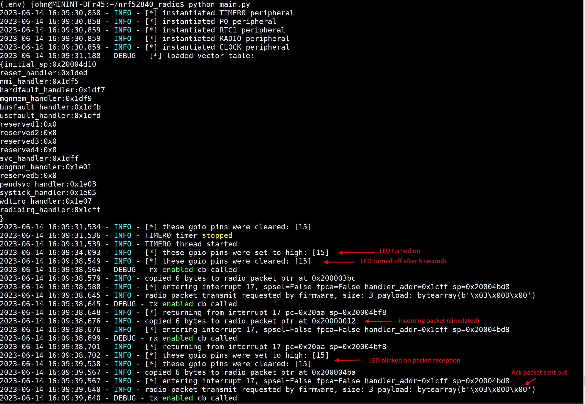

# Introduction
This repository contains complete code for the video tutorial series [Writing an emulator for the nRF52840 SoC to run a bare-metal radio firmware](https://youtu.be/4rtpg1qXOOw). Several industrial IoT devices have implement custom 2.4 GHz radio protocols on the Nordic semiconductor nRF52840 SoC by directly accessing radio transceiver through MMIO registers as documented [here](https://infocenter.nordicsemi.com/index.jsp?topic=%2Fps_nrf52840%2Fradio.html). For demonstration purpose, this emulator is customized to run the latest version of the [Coriandolo Radio protocol](https://github.com/cr-craig/CoriandoloRadio) firmware binary (data/CoriandoloRadio.bin). This emulator can be extended for running and fuzz testing other real-world custom radio protocols that are written for nRF51 and nRF52 SoCs.

# Emulation Results
The included firmware binary in this repository is built from the "RadioTest_CR" app published on the [Coriandolo Radio code repository](https://github.com/cr-craig/CoriandoloRadio) that should exhibit the following behaviour upon execution according to the README file:

*"RadioTest_CR blinks the LEDs on the SENSOR and BASE to indicate how many messages were received in an exchange; in a "perfect" exchange the SENSOR LED will blink 8 times and the BASE LED will blink 9 times (extra blink for the Announcement)."*

The following screenshot shows RadioText_CR firmware binary running under this emulator and exhibiting the expected behaviour

